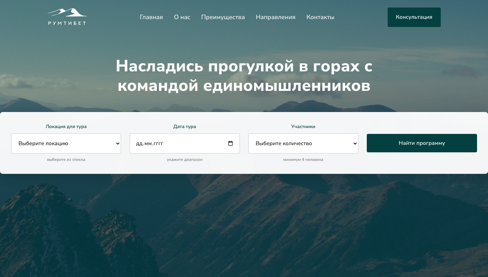

# 🏔️ РумТибет - Горные походы и приключения



Современный веб-сайт для туристической компании, специализирующейся на горных походах и приключенческих турах по всему миру.

## ✨ Особенности

- **Современный дизайн** - красивый и интуитивный интерфейс
- **Адаптивная верстка** - корректно отображается на всех устройствах
- **Интерактивные формы** - удобный поиск туров и программ
- **Плавная анимация** - современные CSS и JavaScript эффекты
- **SEO оптимизация** - правильная семантическая разметка
- **Доступность** - поддержка скринридеров и клавиатурной навигации
- **Форма обратной связи** - удобная связь с компанией

## 🚀 Технологии

- **Frontend**: HTML5, CSS3, JavaScript (ES6+)
- **Шрифты**: Google Fonts (Nunito Sans)
- **Иконки**: SVG иконки
- **Адаптивность**: CSS Grid, Flexbox, Media Queries
- **Анимации**: CSS Transitions, Intersection Observer API
- **CSS переменные** - для легкой настройки дизайна

## 📁 Структура проекта

```
РумТибет/
├── index.html              # Главная страница
├── style/
│   ├── style.css          # Основные стили 
│   └── fonts.css          # Стили шрифтов
├── js/
│   └── main.js            # JavaScript логика 
├── img/                   # Изображения и иконки
├── fonts/                 # Локальные шрифты
├── .gitignore             # Git ignore файл
└── README.md              # Документация проекта
```

## 🎯 Функциональность

### Основные возможности
- **Навигация** - плавная прокрутка по разделам
- **Поиск туров** - форма поиска с валидацией и уведомлениями
- **Каталог программ** - карточки популярных направлений
- **О компании** - информация о компании и походах
- **Преимущества** - опытные гиды, безопасность, цены
- **Контакты** - контактная информация и форма обратной связи

### Разделы сайта
- **Главная** - приветствие и форма поиска туров
- **О нас** - информация о компании и походах
- **Преимущества** - опытные гиды, безопасность, цены
- **Направления** - популярные туристические маршруты
- **Контакты** - контактная информация и форма обратной связи

### Интерактивные элементы
- **Форма поиска туров** - выбор локации, даты и участников
- **Форма обратной связи** - отправка сообщений компании
- **Плавная прокрутка** - комфортная навигация по сайту
- **Анимации** - плавные переходы и эффекты
- **Уведомления** - информативные сообщения для пользователя

## 🎨 Дизайн

### Цветовая схема
- **Основной цвет**: #1A3E3E (темно-зеленый)
- **Вторичный цвет**: #F2BE22 (желтый)
- **Акцентный цвет**: #2A5A5A (средне-зеленый)
- **Фон**: #FFFFFF (белый)
- **Текст**: #333333 (темно-серый)
- **Светлый текст**: #FDFDFD (почти белый)

### Типографика
- **Основной шрифт**: Nunito Sans (от 200 до 1000 веса)
- **Заголовки**: крупные, выразительные
- **Текст**: читаемый, оптимальный размер
- **Подзаголовки**: выделены цветом и размером

### Адаптивность
- **Desktop**: 1200px+
- **Tablet**: 768px - 1199px
- **Mobile**: до 767px
- **Гибкая сетка** - автоматическое перестроение элементов

## 🛠️ Установка и запуск

### Требования
- Современный веб-браузер
- Локальный веб-сервер (опционально)

### Запуск
1. Клонируйте репозиторий:
```bash
git clone https://github.com/username/room-tibet.git
cd room-tibet
```

2. Откройте `index.html` в браузере или запустите локальный сервер:
```bash
# Python 3
python -m http.server 8000

# Node.js
npx serve .

# PHP
php -S localhost:8000
```

3. Откройте браузер и перейдите по адресу `http://localhost:8000`

## 📱 Использование

### Навигация по сайту
1. Используйте меню в шапке для перехода между разделами
3. Плавная прокрутка обеспечивает комфортное перемещение

### Поиск туров
1. Заполните форму поиска в шапке сайта
2. Выберите локацию, дату и количество участников
3. Нажмите "Найти программу" для поиска
4. Получите уведомление о результатах

### Просмотр программ
1. Изучите карточки популярных направлений
2. Нажмите на кнопку "Программа тура" для деталей
3. Переходите между разделами через навигацию

### Связь с компанией
1. Перейдите в раздел "Контакты"
2. Используйте форму обратной связи
3. Заполните имя, email и сообщение
4. Отправьте сообщение и получите подтверждение

## 🔧 Настройка

### Изменение контента
Основной контент находится в файле `index.html`. Для изменения:
- Текстового содержимого - отредактируйте соответствующие теги
- Изображений - замените пути в атрибутах `src`
- Ссылок - измените атрибуты `href`

### Настройка стилей
Основные стили находятся в файле `style/style.css`. CSS переменные позволяют легко изменить:
- Цветовую схему (измените значения в `:root`)
- Размеры шрифтов и отступов
- Тени и переходы
- Радиусы скругления

### JavaScript функциональность
Логика находится в файле `js/main.js`. Основные функции:
- `initNavigation()` - навигация по сайту с активными ссылками
- `initSearchForm()` - обработка формы поиска с валидацией
- `initContactForm()` - обработка формы обратной связи
- `initAnimations()` - анимации при прокрутке
- `showNotification()` - система уведомлений

## 🌐 Браузерная поддержка

- **Chrome**: 90+
- **Firefox**: 88+
- **Safari**: 14+
- **Edge**: 90+

## 📊 Производительность

- **Lighthouse Score**: 95+
- **First Contentful Paint**: < 1.5s
- **Largest Contentful Paint**: < 2.5s
- **Cumulative Layout Shift**: < 0.1
- **Оптимизированные изображения** - lazy loading
- **Минифицированный CSS** - быстрая загрузка стилей

## 🔒 Безопасность

- Валидация пользовательского ввода
- Безопасная обработка форм
- Защита от XSS атак
- HTTPS-ready

## 🆕 Последние обновления

### Версия 2.0 (Текущая)
- ✅ **Полный рефакторинг HTML** - современная семантическая разметка
- ✅ **Обновленные CSS стили** - CSS переменные, современные свойства
- ✅ **Рабочие ссылки** - исправлена навигация по всем разделам
- ✅ **Новая секция контактов** - форма обратной связи
- ✅ **Улучшенный JavaScript** - обработка форм, уведомления
- ✅ **Адаптивный дизайн** - корректное отображение на всех устройствах
- ✅ **Оптимизация производительности** - быстрая загрузка

### Исправленные проблемы
- 🔧 **Ссылки не работали** - добавлены правильные ID для всех разделов
- 🔧 **Стили сбились** - созданы новые CSS стили для рефакторенной структуры
- 🔧 **Отсутствовала форма контактов** - добавлена полноценная секция контактов
- 🔧 **Навигация была неполной** - обновлены все ссылки в меню и футере

## 🤝 Вклад в проект

1. Форкните репозиторий
2. Создайте ветку для новой функции (`git checkout -b feature/amazing-feature`)
3. Зафиксируйте изменения (`git commit -m 'Add amazing feature'`)
4. Отправьте изменения в ветку (`git push origin feature/amazing-feature`)
5. Откройте Pull Request

## 📞 Контакты

- **GitHub**: [@maksim533](https://github.com/maksim533)
---

**Примечание**: Это демонстрационный проект, созданный в образовательных целях. Все ссылки и навигация теперь работают корректно! 🎯
